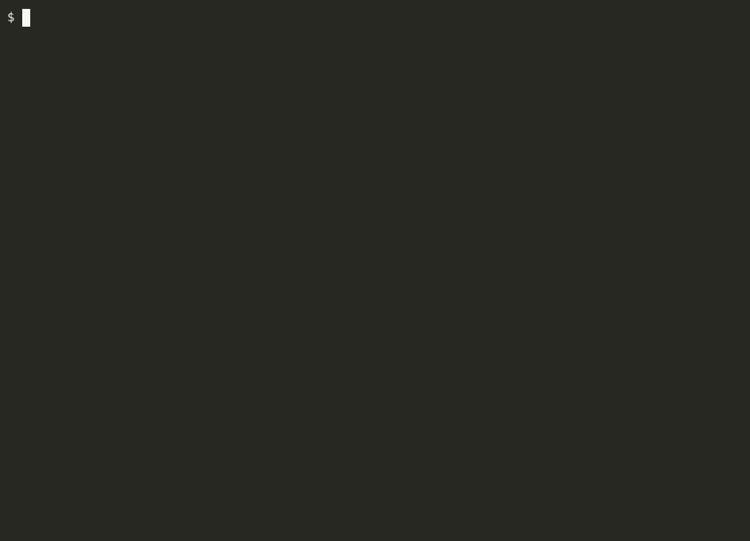
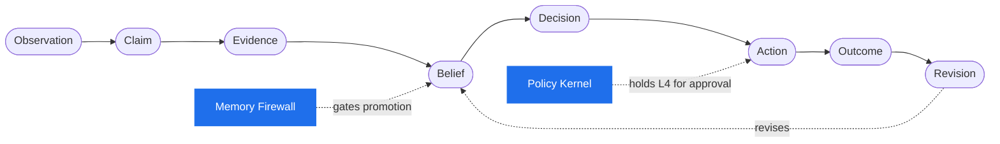
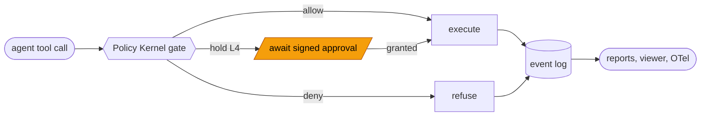

<div align="center">


### The trust layer for AI agents.

*Know what your agent believed, why it acted, and whether it was right.*

[](https://www.npmjs.com/package/@qmilab/lodestar-core)
[](LICENSE)
[](packs/)
[](https://bun.sh)
[](https://qmilab.com/lodestar/docs)

[**Docs**](https://qmilab.com/lodestar/docs) · [**Quickstart**](#the-four-developer-entry-points) · [**Walkthrough**](https://qmilab.com/lodestar/docs/guides/walkthrough/) · [**Concepts**](https://qmilab.com/lodestar/docs/concepts/epistemic-chain/)

</div>

---

Agents are becoming powerful enough to change code, call APIs, deploy systems, and publish content. But when something goes wrong, teams cannot answer basic questions:

- What did the agent believe?
- Where did that belief come from?
- Which action depended on it?
- Was the belief verified?
- Did the agent learn the right lesson afterward?

Lodestar gives agents a trust layer: claims, evidence, decisions, approvals, memory governance, and outcome tracking. Every action the agent takes leaves an audit trail that can be replayed, explained, and graded.

Lodestar is a research project of [QMI Lab](https://qmilab.com).

> **▶ See it in action.** A poisoned file tries to hijack a wrapped coding agent — and the firewall holds. The full [walkthrough](https://qmilab.com/lodestar/docs/guides/walkthrough/) wraps a real agent and gets a trust report.

[](https://qmilab.com/lodestar/docs/guides/walkthrough/)

<sub>Plays inline (interactive) on the [docs site](https://qmilab.com/lodestar/docs/guides/walkthrough/); the source [asciinema cast](docs/guides/assets/telenotes-poison.cast) lives in the repo.</sub>

---

## What it does

Lodestar tracks the full **epistemic chain** — from what an agent observed to how it revised itself — and governs the two points that matter most: which beliefs become *trusted*, and which actions are *allowed to run*.



It wraps an agent so that:

1. **Tool calls are mediated.** Every action the agent attempts passes through a typed contract, a policy check, and (if needed) an approval step before it executes.
2. **Observations become claims.** When a tool returns, its output is extracted into structured claims — propositions the agent might come to believe.
3. **Claims need evidence.** A claim becomes a belief only after the firewall has weighed the evidence behind it, including evidence from prior beliefs.
4. **Memory is governed.** Beliefs move through four orthogonal lifecycle axes (truth, retrieval, security, freshness) under explicit transition rules. No belief silently promotes itself just because the agent succeeded once.
5. **Everything is auditable.** A complete, replay-grade event log records every claim, belief, decision, action, and revision — with payload hashes and monotonic sequence numbers.
6. **Why-did-it-do-this reports.** Given a session, Lodestar produces a human-readable trace that explains what the agent believed, what evidence it had, and which beliefs informed which actions.

---

## Where it fits among existing tools

| You use… | Lodestar's role |
| --- | --- |
| **Claude Code, Cursor, OpenClaw, Hermes, LangGraph, CrewAI** for agent runtime | Lodestar wraps and governs their actions |
| **mem0, Letta, Zep, vector DBs** for memory | Lodestar governs what is safe to remember and retrieve |
| **LangSmith, Langfuse, Phoenix, Braintrust** for observability | Lodestar exports traces and adds epistemic semantics on top |
| **MS Agent Governance Toolkit, MCP gateways** for policy | Lodestar extends governance to beliefs, memory, skills, and confidence |
| **Claude Skills, MCP servers, plugin marketplaces** for capabilities | Lodestar verifies, signs, scores, and policy-wraps them |

Use LangSmith to see traces. Use Lodestar to see which claims became beliefs, which beliefs drove actions, and whether policy allowed those actions.

Use mem0 for memory. Use Lodestar to govern memory promotion and retrieval.

Use Claude Code or OpenClaw to run the agent. Use Lodestar to make its actions and memories trustworthy.

**Lodestar does not replace your agent runtime, your memory store, or your observability platform.** It adds a governance layer over the epistemic chain that those systems do not model directly.

---

## The four developer entry points

Lodestar is one architecture, exposed through four developer-facing packages. Everything is published to npm under the `@qmilab/lodestar-*` scope (Apache-2.0); the CLI is Bun-native, so install with Bun:

```sh
bun add @qmilab/lodestar-guard       # the write side, in code
bun add -g @qmilab/lodestar-cli      # the `lodestar` CLI (report, view, guard, harness, …)
```

### `@qmilab/lodestar-guard`
The **write side**. Wraps agent tool calls, captures observations, gates risky actions, records the epistemic chain. This is the first thing most developers adopt.

```ts
import { guard } from "@qmilab/lodestar-guard"
const agent = guard.wrap({
  tools,
  memory,
  policy: "./lodestar.policy.ts",
  traceTo: "langfuse",
})
```

Risky actions run through the Policy Kernel (`@qmilab/lodestar-policy-kernel`): an L4 egress — a `git push`, an `http.request`, a Slack post — is **held** at `pending_approval` until an approval is granted. Native governed adapters for git, http, nostr, messaging, and shell ship in the box.



Or wrap any MCP-speaking agent (Claude Code, Cursor, Aider) with **no changes to the agent**, via the stdio MCP proxy:

```
lodestar guard mcp-proxy --config lodestar.proxy.json
```

### `@qmilab/lodestar-trace`
The **read side**. Consumes the event log and produces "why did the agent do this?" reports. Markdown, HTML, or piped exports to LangSmith / Langfuse / Phoenix. The package is `@qmilab/lodestar-trace`; the user-facing CLI command is `lodestar report`.

```
lodestar report <session-id>
```

For a live view, `@qmilab/lodestar-viewer` serves the same chain as a local, strictly read-only web UI (`lodestar view`), and `@qmilab/lodestar-otel-exporter` projects a session into OpenTelemetry GenAI spans (`lodestar otel export`) for LangSmith / Langfuse / Phoenix.

### `@qmilab/lodestar-memory-firewall`
The **memory governance entry point**. Works alongside [mem0](https://github.com/mem0ai/mem0), [Letta](https://github.com/letta-ai/letta), [Zep](https://github.com/getzep/zep), or custom memory layers. Decides what beliefs to adopt, retrieve, quarantine, or block — with audited transitions on four lifecycle axes (truth, retrieval, security, freshness).

```ts
import { MemoryFirewall } from "@qmilab/lodestar-memory-firewall"
// each adapter is a separate npm package so you only install the SDK you use:
import { Mem0Adapter } from "@qmilab/lodestar-memory-firewall-mem0"
// also available: @qmilab/lodestar-memory-firewall-letta,
//                 @qmilab/lodestar-memory-firewall-zep

const adapter = new Mem0Adapter(firewall, evidenceStore)
await adapter.importMemories(mem0Export, importOptions)
```

### `@qmilab/lodestar-harness`
**Probes, sentinels, and calibrators.** Safety tests, runtime monitors, and confidence-vs-outcome measurement. The natural surface for community-shared trust packs.

```
lodestar harness run --pack coding-agent-safety
```

---

## What's in the box

All 27 packages and their dependencies are licensed under **Apache 2.0**:

- `@qmilab/lodestar-core` (schemas)
- `@qmilab/lodestar-event-log`
- `@qmilab/lodestar-action-kernel`
- `@qmilab/lodestar-policy-kernel`
- `@qmilab/lodestar-memory-firewall` (plus the mem0 / Letta / Zep import adapters)
- `@qmilab/lodestar-cognitive-core`
- `@qmilab/lodestar-guard` and `@qmilab/lodestar-guard-mcp` (the MCP proxy)
- `@qmilab/lodestar-runtime-core` (the language-agnostic runtime-gate sidecar behind the LangGraph / CrewAI / AutoGen Python hooks)
- `@qmilab/lodestar-trace`, `@qmilab/lodestar-viewer` (the read-side Governing UI), `@qmilab/lodestar-otel-exporter`, and `@qmilab/lodestar-ship` (the session shipper)
- `@qmilab/lodestar-harness`
- `@qmilab/lodestar-cli`
- The native governed adapters: `filesystem`, `git` transport, `shell`, `nostr`, `http`, `messaging`, `sql`, `vector`, and `payments`
- Example probe packs and research benchmarks
- Policy language and replay

Everything runs locally — free, Apache-2.0, no hosted service and no account required.

---

## Status

**v0.5.0 — published to npm (27 packages via CI trusted publishing), v0.2 architecture. Renamed from the internal codename Orrery to Lodestar prior to public launch.** Batches 1–5 are complete, and the post-v1 build track has landed: sentinel→action wiring, the Policy Kernel, nine native governed adapters, the read-side Governing UI, the OpenTelemetry exporter, signed approval resolutions, and a durable calibration event. The v1.5 build track has also landed: the non-MCP runtime adapters (LangGraph / CrewAI / AutoGen Python hooks on the shared runtime-gate, published to PyPI), the trust-pack registry, and the cognitive-core belief-enrichment epic.

**Highlights:**

- ⛓️ The full **epistemic chain** over a replay-grade NDJSON event log (payload hashes, monotonic sequence)
- 🧠 The four-axis **memory firewall** — no belief silently promotes itself
- 🚦 The **Policy Kernel** — a three-valued gate (allow / deny / **hold**), the trust ladder, and Ed25519-signed L4 approvals
- 🔌 Nine native **governed** adapters — filesystem · shell · git · nostr · http · messaging · sql · vector · payments
- 👁️ Read side: `lodestar report`, a live **viewer**, OpenTelemetry export, and the session shipper
- 🔬 **79 probes** as executable spec, green under strict TypeScript

<details>
<summary><strong>Everything that ships today</strong> — click to expand the full list</summary>

- ✅ Full schema layer for the epistemic chain (Observation, Claim, Evidence, Belief, Decision, Action, Outcome, Revision, Explanation)
- ✅ Append-only NDJSON event log with monotonic sequence numbers, payload hashes, and per-partition append serialization
- ✅ Two-phase action execution with precondition revalidation and required `KernelContext` (no silent stub fallback)
- ✅ Memory firewall with four orthogonal lifecycle axes, per-axis transition tables, and subject-related contradiction routing — with in-memory **and** Postgres (`Bun.SQL`) store backends behind one interface, so belief/claim/evidence state can persist and be shared across sessions
- ✅ Cognitive core: claim extractors, evidence linker, world model, ingestion orchestrator, Round 5 auto-observation gate
- ✅ `@qmilab/lodestar-guard` — `wrap()` helper that drives a homegrown agent loop through the full trust layer
- ✅ `@qmilab/lodestar-guard-mcp` — **stdio MCP proxy** that wraps any MCP-speaking agent (Claude Code, Cursor, Aider) without code changes to the agent. Every `tools/call` runs through the Action Kernel; every result through the Cognitive Core. (Batch 3.)
- ✅ `@qmilab/lodestar-trace` — `lodestar report <session-id>` renders a markdown trust report from any event log
- ✅ Stub adapters for mem0, Letta, and Zep under `packages/memory-firewall/adapters/` — design contracts plus one working `importMemories` method each
- ✅ **The Policy Kernel** (`@qmilab/lodestar-policy-kernel`) — a three-valued gate (allow / deny / **hold**) compiled from a signed policy document, with a trust-ladder floor, the approval lifecycle, and an arbitrate hook that lets sentinel alerts and calibration flags strengthen (never weaken) a decision. An L4 action stays at `pending_approval` until an approval is granted, and a granted approval still revalidates preconditions before it runs.
- ✅ **Signed approval resolutions** — out-of-band approvals carry an Ed25519 signature verified against operator-pinned approver keys, so a forged, unsigned, or tampered grant cannot un-park a held L4 across a process boundary.
- ✅ **Sentinel → action wiring** — a real sentinel alert (e.g. `suspicious-memory-origin`) flows through the gate's arbitrate hook to actually **hold** the dependent action, in both `guard.wrap()` (agent-declared decisions) and the MCP proxy (synthesized decisions for an opaque agent).
- ✅ **Nine native, governed adapters**, each a TS-level governance boundary holding its invariants through the kernel — an L4 egress stays held until approved, the credential never surfaces in inputs/observation, and destinations are operator-pinned: `filesystem` (`fs.read`/`doc.read`/`fs.write`), `shell`, `git` transport (`commit`/`push`/`clone`), `nostr` (`publish`/`fetch`), `http` (`request`/`fetch`, with per-hop redirect re-validation against SSRF), `messaging` (`slack.post`/`email.send`), `sql` (`query`/`execute`, the parameterized-only injection boundary with a server-side-cursor bounded fetch), `vector` (`query`, the RAG-poisoning surface), and `payments` (`payment.send`, the irreversible-egress human-approval case).
- ✅ **The read-side Governing UI** (`@qmilab/lodestar-viewer`, `lodestar view`) — a local, **strictly read-only** web viewer over the event log (Elysia + a no-build SPA): surfaces the chain and pending approvals, exposes no mutation route, and never writes the log.
- ✅ **OpenTelemetry export** (`@qmilab/lodestar-otel-exporter`, `lodestar otel export`) — projects a session into OTLP/HTTP-JSON GenAI spans (action-centric), with a sensitivity-ceiling export gate (content above the ceiling ships as metadata + a payload hash only).
- ✅ **Durable calibration** — a calibration pass is recorded as a governed `calibration.computed@1` event (audit + replay via a cursor window), with the Calibrator staying strictly measure-only.
- ✅ Reorganised CLI: `lodestar report`, `lodestar view`, `lodestar otel export`, `lodestar guard wrap`, `lodestar guard mcp-proxy --config <path>`, `lodestar approve list/grant/deny`, `lodestar action list/describe`, `lodestar trace inspect`, `lodestar probe <name>`, `lodestar harness run/list/calibrate`, `lodestar reflect`
- ✅ `@qmilab/lodestar-harness` (Batch 4) — probe-pack format + loader, the `Probe` base class + pack runner driven by `lodestar harness run`, the `Sentinel` base class and three sentinels (`low-confidence-action`, `suspicious-memory-origin`, `anomalous-tool-sequence`), and the `Calibrator` (per-class ECE / Brier / calibration-gap tables). The three sentinels are folded into the `coding-agent-safety` pack — the manifest declares them by id under a `sentinels` field and the loader resolves each against the first-party registry. Reflection has landed in the cognitive core.
- ✅ **Seventy-nine** passing probes under strict TypeScript across two packs. Seventy-five live in the first-party pack `packs/lodestar-core/`: the firewall/guard/contract probes and pre-Batch-3 invariants from earlier batches, the two MCP-proxy probes, the Batch 4/5 probes, the cognitive-core belief-enrichment probes (#154 — the evidence-linker cross-belief join, the belief→lesson harvest projection, the reflection DERIVE rule, the generic LLM extractor, the corroboration scalar, and the world-model gate), fourteen Policy Kernel probes (the three-valued gate, the trust-ladder floor, the approval lifecycle, signature verification, the pluggable approval channel, and the signed-approval forgery boundary), the host-side sentinel→action wiring probes, the read-side viewer's read-only probe, the two OTel-exporter probes, the session-shipper probes, the trust-pack registry probes, the probe-runner containment probes, the LangGraph/CrewAI/AutoGen runtime-adapter probes, the public-API stability probe, one probe per native adapter (filesystem, shell, git, nostr, http, messaging, sql, vector, payments — each driving the real adapter through the real kernel), and the durable-calibration probe. The other four live in the non-core pack `packs/coding-agent-safety/`: `prompt-injection-cross-tool`, `tool-poisoning-cross-session`, `confidence-drift` (the one that drives the Calibrator), and `poisoned-file-cannot-hijack-feature-work` (the governed-dev no-hijack invariant). Probes are spec, not test scaffolding.
- ✅ End-to-end examples:
  - `examples/telenotes-governed-dev/` — the headline governed-dev pipeline: a coding agent adds a feature through the MCP proxy (observe → decide → edit → test → commit → blocked-L4-push), plus a self-verifying poison run and a captured real-Claude-Code run
  - `examples/documentation-agent/` — claim/evidence provenance over documentation content via the `DocAwareEvidenceLinker` cognitive seam
  - `examples/doc-insight/` — auto-observation gate demo
  - `examples/coding-agent-greenfield/` — `guard.wrap()` applied to a homegrown coding-agent loop
  - `examples/claude-code-wrapped/` — MCP proxy wrapping a stand-in agent that talks to `@modelcontextprotocol/server-filesystem`; produces a demo-quality trust report

</details>

What's coming (post-v1):

- A public registry for policy / probe / sentinel packs, with signed, verifiable manifests
- The arXiv position paper: epistemic governance as an architectural primitive

Read the docs at **[qmilab.com/lodestar/docs](https://qmilab.com/lodestar/docs)**. See [`docs/roadmap.md`](./docs/roadmap.md) for the full plan and [`docs/architecture/`](./docs/architecture/) for the design memos.

---

## Try the scaffold

```sh
# Install Bun if needed: https://bun.sh
bun install
bun run example:telenotes:scripted   # governed-dev: wrap a coding agent → trust report
bun run example:telenotes:poison     # the same run + a poisoned file → firewall HELD
bun run probes:ci                     # all 79 probes (both packs)
```

All seventy-nine probes pass. (Seven need extra infrastructure and skip loudly without it: three — `tool-poisoning-cross-session`, `sql-adapter-enforces-invariants`, and `vector-adapter-enforces-invariants` — need a Postgres test database via `LODESTAR_TEST_DATABASE_URL`; one needs an OS sandbox mechanism (`sandbox-exec` / `bubblewrap`); and one each needs a Python + LangGraph / CrewAI / AutoGen runtime. CI provides all of them.) The governed-dev runs render a full epistemic-chain trust report (committed under `examples/telenotes-governed-dev/reports/`); the poison run additionally self-verifies the firewall and prints `firewall verdict: HELD`.

---

## Research arc

Lodestar's deeper architecture is described in academic voice in [`docs/architecture/`](./docs/architecture/). The framing there is "epistemic governance for agentic systems" — that phrase belongs in the whitepaper and citations, not on the homepage.

Planned research outputs:

- Memory-poisoning threat taxonomy and empirical probe results
- Calibration framework: confidence-vs-outcome measurement for agent beliefs
- Evaluation methodology for trust-aware agent systems
- Position paper: epistemic governance as an architectural primitive

---

## License

Apache 2.0 for all open-source packages. See [LICENSE](./LICENSE).

## Acknowledgements

The architecture has been refined across multiple adversarial review rounds with collaborators including ChatGPT, with the underlying design crystallized through several iterations of memo, probe, and counter-example. See [`docs/architecture/v02-delta.md`](./docs/architecture/v02-delta.md) for the review history.
